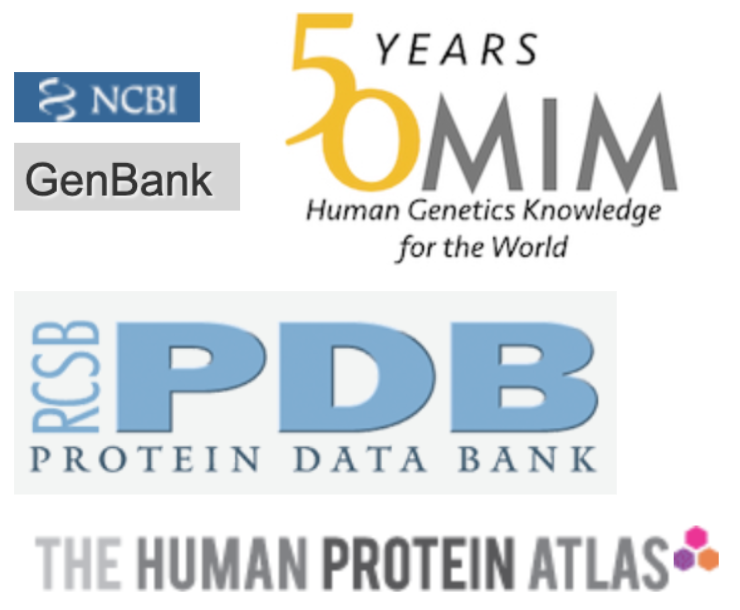

```{r, echo=FALSE, fig.alt="Logos from different biological databases, including Human Protein Atlas, Protein Data Bank, Genbank, and Online Mendelian Inheritance in Man", fig.cap = "Logos from several biological databases"}


```

### Overview {-}

#### Purpose {-}

In this project, students  will search the same online databases used by scientists to collect information about a set of genes and present them to your group. This will give you an opportunity to engage in inquiry-based learning and apply the concepts in molecular biology and genetics from this course.

#### Learning Objectives {-}

1. Use online databases to look up information about a gene.
1. Present scientific research to an audience of peers.

### Activity 1 - Research a Gene! {-}

Estimated time: 45  min

#### Instructions {-}

1. Before getting started on this activity, your instructor will assign your group a letter that corresponds to a group of 4 genes.

| Group Assigned Letter |
|:-|
| <br> |

2. [Look up your letter here](https://docs.google.com/spreadsheets/d/1GZtHz2GU3B4KMOd9yuKrcQLJJLn7qlnZgPN5c6SNqGg) and write the names of the four genes your group is assigned at the top of each column in the table below.
3. In your group, assign each student one of the four genes to research.

| Individual Assigned Gene |
|:-|
| <br> |

4. Use FlyBase to look up the information in Table 2 below.
5. Use HPA to look up the information in Table 3 below.

Table 2. FlyBase Information

| Category | Information |
|----------|-------------|
| **General Information** | |
| Full Gene Name | |
| FlyBase ID | |
| Sequence Location | |
| **Function** | |
| Biological Process | |
| Cellular Component | |
| **Expression Data** | |
| Anatomical Expression | |
| Developmental Stage | |
| **Orthologs** | |
| Orthologs in other species | |
| Human Orthologs | |

Table 3. Human Protein Atlas

| Category | Information |
|----------|-------------|
| Function | |
| Is the gene tissue specific? Which tissue? | |
| Where is it localized in cells? | |

### Activity 2 - Present to your Group {-}

Estimated time: 15 min

#### Instructions {-}

1. Present your gene to your group.
1. Take turns presenting your genes among your group and decide on one gene that you think is the most interesting.

### Activity 3 - Class Presentation {-}

Estimated time: 30 min

#### Instructions {-}

1. With your group, create a short presentation about your chosen gene for the class.
1. Your presentation should have about four slides and be thorough:
    1. Slide 1: The GENE you picked to share with your group, your name and date
    1. Slide 2 - 4: Present the information you collected about the gene.  For full credit, include relevant images/diagrams on your slides.
1. One student in the group should submit your slides. Make sure you mention everyone in your group by name so they also get credit for the presentation.

### Footnotes {-}

#### Resources {-}

- [Google Doc](https://docs.google.com/document/d/1M7rtDzyGVUxO2GVBp09bTBu4fMDxocTs)

#### Contributions and Affiliations {-}

- Rosa Alcazar, Ph.D., Clovis Community College
- Katherine Cox, Ph.D., John Hopkins University
- Stephanie R. Coffman, Ph.D., Clovis Community College
- Frederick Tan, Ph.D., Carnegie Institution for Science

Last Revised: July 2023
