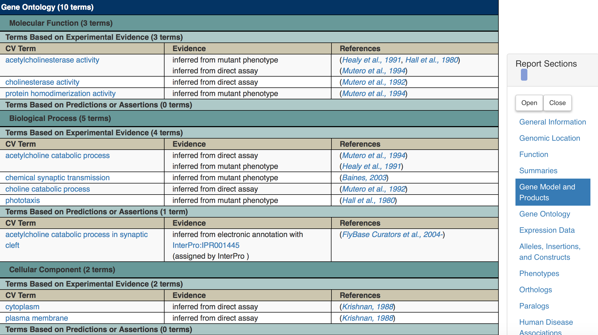
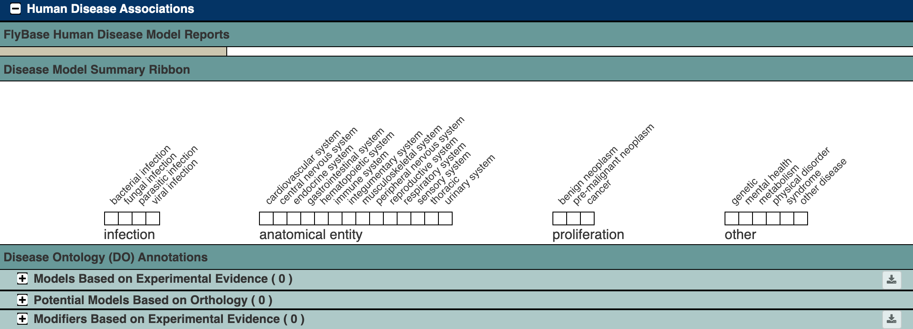

## Biological Databases: FlyBase

```{r, echo=FALSE, fig.alt="FlyBase logo", fig.cap = "FlyBase logo"}
knitr::include_graphics("assets/database_FlyBase/FlyBase_logo.png")
```

#### Learning Goals {-}

- Use FlyBase to look up information about genes by name, gene symbol, or FlyBase ID number
- Use FlyBase to find fruit fly models of human disease

### What is FlyBase?

```{r, echo=FALSE, fig.alt="Screenshot of the top of the FlyBase homepage, showing buttons linking out to various tools.  The searchbox labeled 'Jump to Gene' is circled.", fig.cap = "Katherine Cox (2021). Screenshot of the top of the FlyBase homepage https://flybase.org/. License: [CC BY 4.0](https://creativecommons.org/licenses/by/4.0/)"}

knitr::include_graphics("assets/database_FlyBase/FlyBase_home.png")
```

FlyBase ([flybase.org](http://flybase.org)) is a website for the *Drosophila* scientific community that organizes research results about *Drosophila*.  We can use it to find out what has been discovered about genes we're interested in.

There are many species of *Drosophila*.  Most research is done using *Drosophila melanogaster* (abbreviated Dmel), but FlyBase also has information about other species of flies.

### FlyBase Gene Pages

One important role for FlyBase is keeping track of all the *Drosophila* genes and what we know about them.  FlyBase maintains a webpage for each known *Drosophila* gene.

#### FlyBase ID

Every gene on FlyBase has a **FlyBase ID** number that looks like this: `FBgnXXXXXXX`, with the X's being different numbers.  FB stands for FlyBase and gn stands for gene.  There are ~17000 *Drosophila melanogaster* genes.  Each known *Drosophila* gene has its own FlyBase ID, and you can use the FlyBase ID to find information about the genes such as what they do and whether they are related to any human genes.

#### Look up a gene on FlyBase

You can look up a gene on FlyBase using the "Jump to Gene" search box.

```{r, echo=FALSE, fig.alt="Screenshot of the top of the FlyBase homepage, showing buttons linking out to various tools.  The searchbox labeled 'Jump to Gene' is circled.", fig.cap = "Katherine Cox (2021). Screenshot of the top of the FlyBase homepage https://flybase.org/. License: [CC BY 4.0](https://creativecommons.org/licenses/by/4.0/)"}

knitr::include_graphics("assets/database_FlyBase/FlyBase_home.png")
```

Here is the page for the gene with FlyBase ID `FBgn0000024`.  This page has a ton of useful information for finding out more about this gene!  We'll highlight a few important things to start with:

```{r, echo=FALSE, fig.alt="Screenshot of the top of the FlyBase page for the Ace gene.  The page contains a table of information about the gene, and two areas of the page are circled.  The first circle encompasses, the Symbol, which is 'Dmel\\Ace' and and the Name, which is 'Acetylcholine esterase'. The second circle encompasses the Gene Snapshot, which says 'Acetylcholine esterase (Ace) encodes an enzyme that catalyzes the hydrolysis of the neurotransmitter acetylcholine to acetate and choline, thus resetting the neurotransmission mechanism at neuromuscular junctions.'.", fig.cap = "Katherine Cox (2021). Screenshot of the top of the FlyBase gene page for Ace https://flybase.org/reports/FBgn0000024. License: [CC BY 4.0](https://creativecommons.org/licenses/by/4.0/)"}

knitr::include_graphics("assets/database_FlyBase/FlyBase_Ace_summary.png")
```

+ The gene **Symbol** and **Name**.  Genes are usually named after what they do, and their symbol is a usually shortened version of the name.  In this case, gene `FBgn0000024` is named Acetylcholine esterase, and is abbreviated *Ace*.  (The Dmel stands for *Drosophila melanogaster*.)
+ The **Gene Snapshot** gives a quick summary of what we know about this gene.  In this case, it's an enzyme involved in neurotransmission.

#### Gene Ontology

Further down the page are the **Gene Ontology** or **GO** terms.  There are 3 categories of GO terms:

+ **Molecular Function**: What does this gene do at a molecular level?  How does it interact with other molecules? (Examples: enzyme - catalyzes a reaction, DNA binding - binds to DNA, transporter - moves something across a membrane)
+ **Biological Process**: What does this gene do for the organism?  What's the "big picture"? (Examples: involved in development, reproduction, immune system, etc.)
+ **Cellular Component**: Where in a cell is the gene found?  (Examples: the nucleus, mitochondria, cell membrane, etc.)

```{r, echo=FALSE, fig.alt="Screenshot of the Gene Ontology section of the Flybase gene page for Ace.  The Gene Ontology table has three columns.  The first column, labeled 'CV Term' lists the Gene Ontology term.  The second column, labeled 'Evidence' gives a brief description of the evidence, for example 'inferred from mutant phenotype'.  The final column, labeled 'References' contains links to scientific papers.", fig.cap = "Katherine Cox (2021). Screenshot of the Gene Ontology section of the FlyBase gene page for Ace https://flybase.org/reports/FBgn0000024#function. License: [CC BY 4.0](https://creativecommons.org/licenses/by/4.0/)"}


```

For the *Ace* gene, we can see its **molecular functions** include acetylcholinesterase activity (it's an enzyme).  You can click on these terms to find out more about them.  For example, if you click on "acetylcholinesterase activity" you can find out more about the reaction that is being catalyzed, and find other genes that carry out this same reaction.

You can also see from this table how we know this information - it tells you what kind of evidence we have to prove it, and it links to the paper where that evidence came from.

#### Other information

This page contains a lot of other information, including any known interactions of this gene with other genes, information about similar genes in other organisms (orthologs), and whether related genes are relevant to any human diseases (we will discuss how to explore these in the next section).  As you investigate *Drosophila* data and find genes that you want to learn more about, FlyBase is a good place to start.

#### Some genes are unknowns

There are some genes that we still don't know anything about.  We can tell from the DNA sequence that there is a protein encoded there because we can see a long string of codons for amino acids.  But we've never discovered what that protein does.  More research is needed!

Here's an example of an unknown gene:

```{r, echo=FALSE, fig.alt="Screenshot of the top of the FlyBase page for the CG14448 gene.  Several of the boxes in the summary table are blank, and the Gene Snapshot says ''Insufficient genetic data for FlyBase to solicit a summary.'", fig.cap = "Katherine Cox (2021). Screenshot of the top of the FlyBase gene page for unknown gene CG14448 https://flybase.org/reports/FBgn0037191. License: [CC BY 4.0](https://creativecommons.org/licenses/by/4.0/)"}

knitr::include_graphics("assets/database_FlyBase/FlyBase_unknown_gene.png")
```

As you can see, it doesn't have a name - we don't know what to name it since we don't know anything about it.  There is also no information for the gene snapshot.

Unknown genes can be frustrating or disappointing, since they don't provide us with any information.  But they can also be exciting - maybe this data is a step towards finding out what they do!

#### Use FlyBase to investigate *labial*

The *labial* gene (gene symbol: *lab*) gene is a gene involved in the copper region of the *Drosophila* midgut, as well as controling the identity of segments that contribute to the head and the anterior thorax.  We can use FlyBase to learn more about this gene.

In most datasets, genes will be listed by an ID number rather than their name, such as the FlyBase ID number (FBgn number).  We can use Flybase to find these IDs and match them up to data in the dataset we're investigating.  

:::{.reflection}
### Exercise {- .unlisted}

Go to FlyBase and search for "lab" in the "Jump to Gene" searchbar.

1. What is the FlyBase ID number for *lab*?
1. What biological processes is the *lab* gene involved in?
:::

### Finding Orthologs

FlyBase also contains information about **orthologs** for each of the FlyBase genes.  Orthologs are genes that have similar sequences and functions across species.

Finding orthologs can be challenging - the sequences are similar, but not identical, and it can be hard to predict whether the gene is likely to be doing the same thing in other species.  There are several different computer programs that will analyze genes (using different features, including their nucleotide and amino acid sequences, predicted structures, and genome locations) to try to identify orthologs.

#### DIOPT to the rescue!

With so many options for finding orthologs, how do you know which one to use?  Fortunately, we don’t have to choose.

DIOPT (DRSC Integrative Ortholog Prediction Tool) is a convenient tool that combines and summarizes information from several different ortholog prediction programs.  Rather than having to pick a single program, you can look at the DIOPT score and see how many of the programs think that a particular gene is an ortholog.

The DIOPT score is very straightforward: out of the total number of ortholog prediction programs, how many of them predicted this gene was an ortholog?  As of writing this tutorial, there are 15 programs for predicting fly-human orthologs, so a score of 7 means 7 out of those 15 programs think that the gene is an ortholog.

FlyBase uses DIOPT to report orthologs.  If you scroll down and expand the Orthologs section for a gene, you can see the list of potential orthologs and their DIOPT scores for several different species, including humans.  It also tells you which programs did or did not predict that particular ortholog.

Here are the top few predicted human orthologs for the *Ace* gene:

```{r, echo=FALSE, fig.alt="Screenshot of the Orthologs section of the Flybase gene page for Ace.  The Orthologs table has several columns.  The first column lists the species and gene name of the potential ortholog.  The second column has the DIOPT score (e.g. 10 of 15).  The fourth column lists out which programs indicated that the gene was an ortholog.", fig.cap = "Katherine Cox (2021). Screenshot of the Orthologs section of the FlyBase gene page for Ace https://flybase.org/reports/FBgn0000024#orthologs. License: [CC BY 4.0](https://creativecommons.org/licenses/by/4.0/)"}

knitr::include_graphics("assets/database_FlyBase/FlyBase_Ace_orthologs.png")
```

In the results, "Hsap" stands for *Homo sapiens*, and the letters and numbers after the slash are the gene symbol.  You can click on these gene symbols to find out more about the human genes.

As you can see, the first two results (BCHE and ACHE) score quite well (10 out of 15 and 9 out of 15), so there’s a pretty good chance that they are orthologs.  It’s not uncommon for there to be multiple human genes that are orthologs of a single fly gene - humans have larger and more complex genomes, so they may have multiple specialized versions of a gene where flies only need a single version.  The rest of the results do not score very high and are much less likely to be true orthologs.

Once you know the likely human orthologs, you can then research those genes in other databases and scientific literature.  We can go back and forth between flies, humans, and other species and compare what we know across all species to try to build up an understanding of what the gene does and what happens when it stops working correctly.

:::{.reflection}
### Exercise {- .unlisted}

Go back to the FlyBase page for the *lab* gene.

1. What is the most likely human ortholog for the *lab* gene?
1. How many programs think this gene is an ortholog of *lab*?
:::

### Disease models

Because disease models are of particular interest, there is a special section in the FlyBase gene report about relationships between that FlyBase gene and any human diseases.  Note that there are 3 types of relationships that are reported:

- **Models Based on Experimental Evidence**: someone has studied flies with disruptions to this gene and has shown that the flies have similar symptoms to humans
- **Potential Models Based on Orthology**: we think this gene could be used to study a particular disease because we think it’s an ortholog, but we don’t have proof.
- **Modifiers Based on Experimental Evidence**: this gene doesn’t directly cause a disease, but makes a disease caused by a different gene better or worse

#### Disease report for the *Ace* gene

The *Ace* gene has no known or predicted relationship to any human diseases, so its report is pretty boring in this section:

```{r, echo=FALSE, fig.alt="Screenshot of the Human Disease Associations section of the Flybase gene page for Ace.  There is a summary at the top that lists several categories of disease - none of them are filled in.  Below, there are sections for the differenct types of disease models, but they are all empty for this gene.", fig.cap = "Katherine Cox (2021). Screenshot of the Human Disease Associations section of the FlyBase gene page for Ace https://flybase.org/reports/FBgn0000024#hdm. License: [CC BY 4.0](https://creativecommons.org/licenses/by/4.0/)"}


```

### Summary
