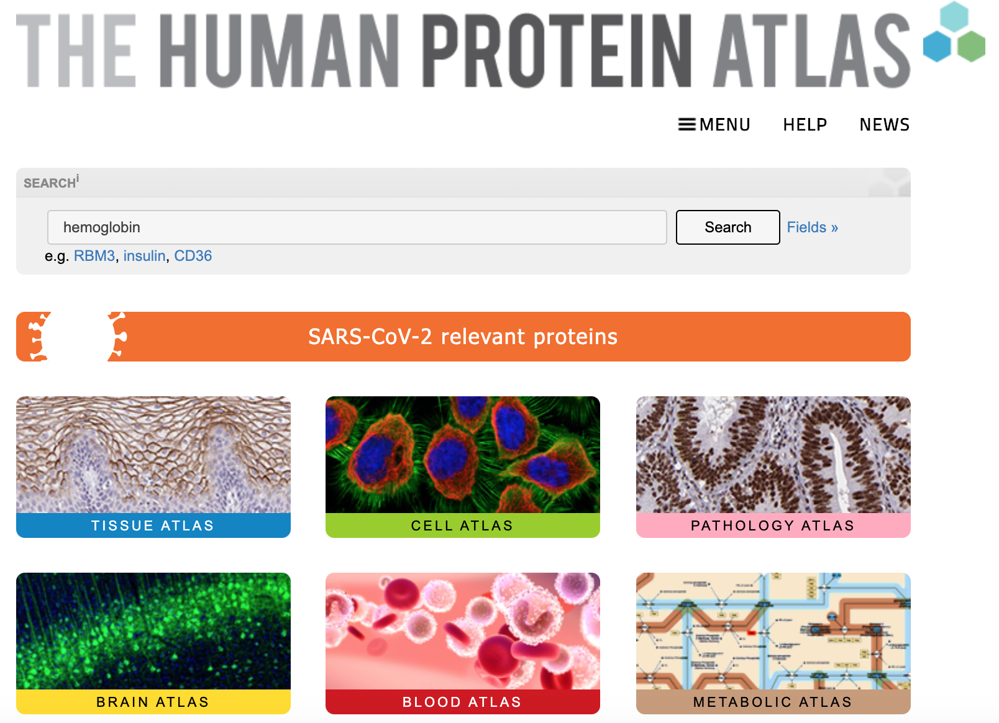

## Human Protein Atlas

```{r, echo=FALSE, fig.alt="Human Protein Atlas logo"}
knitr::include_graphics("assets/database_HPA/HPA_logo.png")
```

#### Learning Goals {-}

- Use the Human Protein Atlas to look up proteins by name and find out where they are localized.

### What is the Human Protein Atlas?

The Human Protein Atlas is a website that organizes research results about human proteins.  It contains many types of information, including what the proteins do, where they are active, and what types of diseases they are involved in.  We can use it to find out what has been discovered about genes we’re interested in.

```{r, echo=FALSE, fig.alt="Screenshot of the Human Protein Atlas homepage, showing a search box as well as buttons linking out to various tools.", fig.cap = "Katherine Cox (2021). Screenshot of the Human Protein Atlas homepage https://www.proteinatlas.org/. License: [CC BY 4.0](https://creativecommons.org/licenses/by/4.0/)"}


```

You will primarily interact with the Human Protein Atlas by typing the names of genes or proteins of interest into the search bar.

The boxes below the search bar ("Tissue Atlas", "Cell Atlas", etc.) provide explanations about the types of information available in the Human Protein Atlas.

#### Reminder: Genes and Proteins {-}

People sometimes use the names of a gene and the protein it "codes for" interchangeably, which can be a bit confusing.

- A **gene** is a DNA sequence (made of **nucleotides**).  It contains the instructions for how to make a specific protein.
- A **protein** is an **amino acid** sequence.  Proteins fold up into specific shapes that let them do their jobs.  Proteins perform the majority of functions in cells, including things like:
    - Carrying out chemical reactions
    - Moving materials around inside the cell
    - Transporting things in and out of a cell

Mutations in a *gene* can cause the *protein* to be made incorrectly, resulting in a protein that does not do its job properly.

Not all genes code for proteins; genes can have other types of information and instructions.  The Human Protein Atlas is focused specifically on proteins and the genes that code for them ("protein-coding genes").

### Protein Pages

### Look up a Protein

### Summary

The Human Protein Atlas is a useful source of information when researching human genes.  Some key features include:

- A convenient summary of what is known about the gene's function
- Information on disease associations
- Nice graphical depictions of where the protein is active
