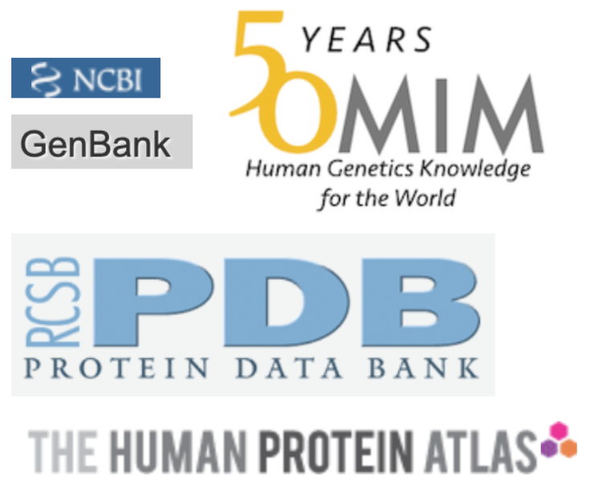

# Exercises: Biological Databases

### Overview {-}

#### Purpose {-}

The three activities in this assignment will give you a quick tour of several online databases for biological research and will teach you how to use these databases to gather information about genes.

#### Learning Objectives {-}

1. Name two biological databases and briefly describe the types of information they each contain.
1. Use online databases to look up information about a gene.

#### Introduction {-}

Scientists often use online databases to store and share their research.  These biological databases make vast amounts of scientific research freely available to anyone, as long as you know where to look.  The first activity will introduce you to a few of these databases by teaching you where to find them and what kinds of information they contain.

[FlyBase](https://flybase.org/) is a database for everything there is to know about fruit flies and their genetics.  The second activity will teach you how to find and learn about fruit fly genes on FlyBase, and how to find out which fruit fly genes correspond to which human genes.

The [Human Protein Atlas](https://www.proteinatlas.org/) contains information about human proteins and where they are located in the body.  The third activity will show you how to use the Human Protein Atlas to discover what tissues a protein is expressed in, as well as its subcellular localization (where in a cell the protein is located).  Knowing the location of a protein can help us figure out what it does.

### **Activity 1** - Databases {-}

Estimated time: 10 min

#### Instructions {-}

1. [Click here to open the Biological Databases Introduction.](https://www.c-moor.org/module-model-org-db/database-intro.html){target="_blank"}
1. As you complete the lesson, fill in the table below. This will help you know which database to go back to later on.

#### Questions {-}

Table 1. Databases

| Database            | Description |
| --------------------|-------------|
| GenBank             |             |
| OMIM                |             |
| Human Protein Atlas |             |
| PDB                 |             |

### **Activity 2** - FlyBase {-}

Estimated time: 15 min

#### Instructions {-}

1. [Click here to open the FlyBase lesson.](https://www.c-moor.org/module-model-org-db/database-flybase.html){target="_blank"}
1. As you complete the lesson, answer the questions below.

#### Questions {-}

| 2A. What is one question you have about using FlyBase? |
|:-|
|   |

 

| 2B. What is something that surprised you or that you found interesting about using FlyBase? |
|:-|
|   |

### **Activity 3** - Human Protein Atlas {-}

Estimated time: 15 min

#### Instructions {-}

1. [Click here to open the Human Protein Atlas lesson.](https://www.c-moor.org/module-model-org-db/database-hpa.html){target="_blank"}
1. As you complete the lesson, answer the questions below.

#### Questions {-}

| 3A. What is one question you have about using HPA? |
|:-|
|   |

 

| 3B. What is something that surprised you or that you found interesting about using HPA? |
|:-|
|   |

### Footnotes {-}

#### Resources

- [Google Doc](https://docs.google.com/document/d/1M7rtDzyGVUxO2GVBp09bTBu4fMDxocTs)

#### Contributions and Affiliations

- Rosa Alcazar, Ph.D., Clovis Community College
- Katherine Cox, Ph.D., John Hopkins
- Stephanie R. Coffman, Ph.D., Clovis Community College
- Frederick Tan, Ph.D., Carnegie Institution for Science

Last Revised: July 2023
