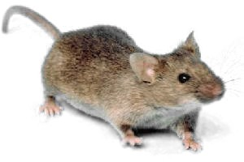

## Introduction to Model Organisms {#model-org-intro}

](assets/model_org_intro/model_organism_collage.jpeg)

#### Learning Objectives {-}

- Explain what a "model organism" is and why they are useful
- Define **ortholog** and explain how model organisms can be used to understand human genes.
- Name 4 commonly used model organisms
- Compare and contrast the pros and cons of different model organisms

### What is a model organism?

Scientists who study biology often choose to focus their work on a few specific organisms.  These are called **model organisms**, because they are being used as a “model” for biological processes occurring in many species.  This works because many biological processes are **conserved** - they work the same way in many different organisms.

Coordinating our experiments in the same organisms has many advantages:

- We can easily compare results and build off of each other’s work
- Tools and techniques developed in one lab can be used by many other researchers
- We build up a strong understanding of those organisms, which makes it easier to understand new results.

Besides studying basic biology, model organisms can also be useful for learning more about humans and human diseases.  There are many questions we would like to answer for which we **can’t conduct human experiments**, either for ethical reasons, or just because it is too difficult.

It’s often much **faster, cheaper, and easier** to conduct experiments in model organisms.  A common strategy is to start by doing many experiments in a simple organism (like yeast), and then follow up on the most promising results in more complex organisms.

#### Models of Huntington's disease {-}

In the following video, you will hear about how researchers are using yeast and fruit flies as model organisms to study Huntington’s disease.

<iframe src="https://www.youtube.com/embed/mqsq7R1Hu4g" width="100%" height="400px"></iframe>

### What makes a good model organism?

Some of the most common model organisms are:

- Mouse (*Mus musculus*)
- Fruit fly (*Drosophila melanogaster*)
- Yeast (*Saccharomyces cerevisiae*)
- E. coli (*Escherichia coli*, a type of bacteria)

These organisms were chosen for a combination of practical and historical reasons

- They have useful properties that makes it easy to do experiments (for example, short generation times make genetic experiments easier)
- Important discoveries were made with them, and scientists continued to work with them to follow up on those discoveries

The more a model organism is studied, the more useful it becomes for future research.

- New tools and techniques are developed, so there are more options for carrying out experiments
- As we learn more about an organism, it becomes easier to interpret new results.  It’s a lot easier to understand how a particular mutation might be causing problems if we already know a lot about the gene the mutation was found in.

### Choosing a model organism

Obviously, the most accurate way to learn about humans is to study humans, but this is not always the best option.  In fact, it can often be more efficient to conduct experiments in simpler organisms - they are smaller, easier to care for, and have shorter generation times, so we can do a lot more experiments.  Then, as we come to have a better understanding of our particular question, we can investigate the nuances in more complex organisms.

Generally the more complex and more similar an organism is to a human, the more confident we can be that the results of an experiment will apply to humans as well.  But, there are other important considerations:

1. **Ethical concerns**: More complex organisms require more care and consideration for their treatment.  We take care to avoid causing unnecessary distress, and evaluate whether a study can be conducted effectively with less complex organisms.
1. **Expense**: More complex organisms are more expensive to care for and tend to reproduce more slowly and in smaller quantities.  With limited time and resources we need to think about how to efficiently obtain the information we are seeking.
1. **Available tools and techniques**: Some organisms are easier to work with than others for particular types of experiments.  Yeast are great for genetics - it’s easy to edit their genome.  Fruit flies are similarly useful for genetics - they aren’t as easy as yeast, but they are the easiest multicellular model organism to work with for genetic experiments.  Zebrafish embryos are transparent, so they are particularly good for microscopy experiments.

### Common model organisms

#### Mouse {-}

{width=40%}

##### Genome {-}
- ~3 billion bases in length (similar to human)
- ~25,000 genes
- **> 99% of human genes have homologs in mice**

##### Reproduction {-}

- Generation time: ~10 weeks
- Usually 6-8 offspring per generation (range ~3-14)
- How long to get 1000 offspring?  **~ 6-8 months**

#### Fruit fly {-}

](assets/model_org_intro/fruit_fly.jpg){width=40%}

##### Genome {-}
- ~140 million bases in length
- ~17,000 genes
- **~ 60% of human genes have orthologs in flies**

##### Reproduction {-}

- Generation time: ~2 weeks
- Hundreds of offspring per generation
- How long to get 1000 offspring?  **~ 1 month**

#### Yeast {-}

](assets/model_org_intro/yeast.jpeg){width=40%}

##### Genome {-}
- ~12 million bases in length
- ~6,000 genes
- **~ 23 of yeast genes have homologs in humans**

##### Reproduction {-}

- Generation time: ~2 hours
- 1 offspring per reproduction ("budding")
- How long to get 1000 offspring? **1 day**

#### *E. coli* {-}

](assets/model_org_intro/ecoli.png){width=40%}

##### Genome {-}
- ~5 million bases in length
- ~4,000 genes

*E. coli* are quite different from humans (much more so than yeast - yeast are still eukaryotes like humans, but *E. coli* are bacteria).  *E. coli* aren't really used to study the functions of human proteins or their orthologs in a living organism, the way yeast are.  But they are very useful for mass-producing copies of a human protein if we want to study it in the lab (for example, measure the activity of an enzyme under different conditions, or try to figure out the structure of a particular protein).

##### Reproduction {-}

- Generation time: ~20 minutes
- 1 offspring per reproduction ("binary fission")
- How long to get 1000 offspring? **4 hours **

#### Other organisms {-}

Many other organisms have been used as model organisms, though they are less common.  They may be more difficult to work with, be less well studied, or not have as many tools and techniques available, and therefore tend to be used for particular types of experiments where they are particularly well suited.  Some examples include:

- **Non-human primates** can be used when we need to get as close as possible to human biology.  Primates are highly intelligent (presenting ethical concerns) are expensive to care for, and have slow generation times, so they are typically only used when there is a strong need for a closer similarity to humans than we can get with other organisms.  
- **Rats** (*Rattus norvegicus*) are sometimes used as an alternative to mice.  They are larger (making them more expensive to care for, but also easier to handle) and more intelligent, which can be useful for some types of experiments.  For some diseases, rat models are more similar to humans than mouse models are.
- **Frogs** (*Xenopus laevis* and *Xenopus tropicalis*) eggs and oocytes are quite large and the embryos develop externally, making them relatively easy to manipulate.  This makes them a good model for early vertebrate development, as well as basic cell and molecular biology.
- **Zebrafish** (*Danio rerio*) are similarly useful for studying early development, as their eggs are fertilized externally (easy to manipulate).  They are particularly useful for microscopy studies, as the embryos are transparent.
- **Worms** (*Caenorhabditis elegans*) are also useful for studying development.  They are transparent throughout their lives, and have small enough body plan that we can keep track of every single cell.

### Summary

- Model organisms allow scientists to conduct many experiments faster, cheaper, and easier than could be done in humans.
- Model organisms allow us to conduct experiments that would be unethical or impossible in humans.
- A common strategy is to start by doing many experiments in a simple organism (like yeast), and then follow up on the most promising results in more complex organisms, including humans.
- Some of the most common model organisms are:
  - Mouse (*Mus musculus*)
  - Fruit fly (*Drosophila melanogaster*)
  - Yeast (*Saccharomyces cerevisiae*)
  - E. coli (*Escherichia coli*, a type of bacteria)
