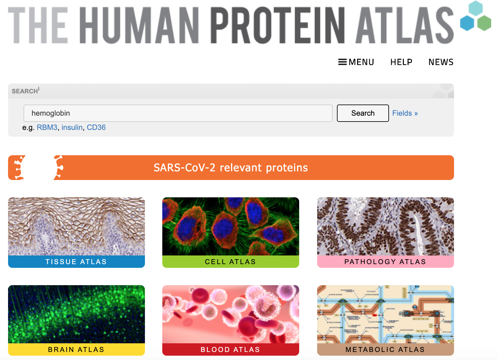
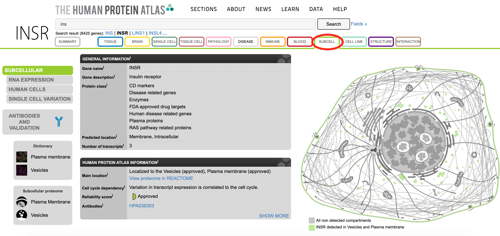

## Human Protein Atlas

#### Learning Goals {-}

- Use the Human Protein Atlas to look up proteins by name and find out where they are localized.

### What is the Human Protein Atlas?

The Human Protein Atlas is a website that organizes research results about human proteins.  It contains many types of information, including what the proteins do, where they are active, and what types of diseases they are involved in.  We can use it to find out what has been discovered about genes we’re interested in.

(\#fig:unnamed-chunk-2)Katherine Cox (2021). Screenshot of the Human Protein Atlas homepage https://www.proteinatlas.org/. License: [CC BY 4.0](https://creativecommons.org/licenses/by/4.0/)

You will primarily interact with the Human Protein Atlas by typing the names of genes or proteins of interest into the search bar.

The boxes below the search bar ("Tissue Atlas", "Cell Atlas", etc.) provide explanations about the types of information available in the Human Protein Atlas.

#### Reminder: Genes and Proteins {-}

People sometimes use the names of a gene and the protein it "codes for" interchangeably, which can be a bit confusing.

- A **gene** is a DNA sequence (made of **nucleotides**).  It contains the instructions for how to make a specific protein.
- A **protein** is an **amino acid** sequence.  Proteins fold up into specific shapes that let them do their jobs.  Proteins perform the majority of functions in cells, including things like:
    - Carrying out chemical reactions
    - Moving materials around inside the cell
    - Transporting things in and out of a cell

Mutations in a *gene* can cause the *protein* to be made incorrectly, resulting in a protein that does not do its job properly.

Not all genes code for proteins; genes can have other types of information and instructions.  The Human Protein Atlas is focused specifically on proteins and the genes that code for them ("protein-coding genes").

### Protein Pages

Every protein in the Human Protein Atlas has its own page with a large collection of information about the protein.  To see what kinds of information is available, we will look at the entry for [**insulin**](https://www.proteinatlas.org/ENSG00000254647-INS).

#### Protein Summary {-}

(\#fig:unnamed-chunk-3)Katherine Cox (2023). Screenshot of the top of the Human Protein Atlas page for INS https://www.proteinatlas.org/ENSG00000254647-INS. License: [CC BY 4.0](https://creativecommons.org/licenses/by/4.0/)

- **Gene name** - The name of the gene that codes for the protein.  If multiple names have been used for this gene, they will be listed in parentheses.  The gene for insulin is named "INS".
- **Protein class** - The Human Protein Atlas designates different "classes" for proteins, which are a bit like tags in a blog - they group proteins into collections based on some common property.  These classes are based on where the protein is located, what the protein does, and what diseases the protein is involved in.  Insulin is in multiple disease classes, because it is involved in both diabetes and cancer.  It is also in the plasma proteins class because it is found in plasma.
- **Protein Expression and Localization** - Where is the protein located? The Human Protein Atlas has several types of information about the protein’s location, such as the tissues, brain regions, and subcellular compartments where the protein has been observed.  More detailed information is available by clicking on the tabs along the top of the page.

Further down the page we can see more information about what the protein does:

(\#fig:unnamed-chunk-4)Katherine Cox (2023). Screenshot of the Protein Function section of the Human Protein Atlas page for INS https://www.proteinatlas.org/ENSG00000254647-INS. License: [CC BY 4.0](https://creativecommons.org/licenses/by/4.0/)

- **What does it do?** (Protein function, Molecular function, Biological process) - What molecular, chemical, and biological processes does it carry out?  Insulin is a hormone involved in carbohydrate metabolism.
- **Gene summary** (at the bottom) - A summary of what we know about this gene.  For insulin, it contains a description of how it is processed, and then an explanation of how it binds to the insulin receptor and stimulates glucose uptake.

#### Tissue Atlas {-}

If we click on the [Tissue tab](https://www.proteinatlas.org/ENSG00000254647-INS/tissue), we can see more detailed information.  Partway down the page you can see diagrams of where the protein is located.

(\#fig:unnamed-chunk-5)Katherine Cox (2023). Screenshot of the RNA and Protein Expression Summary section of the Tissue page for INS from the Human Protein Atlas https://www.proteinatlas.org/ENSG00000254647-INS/tissue. License: [CC BY 4.0](https://creativecommons.org/licenses/by/4.0/)

Insulin is very cleanly localized to the pancreas.  Both the RNA and the protein experimental data show high expression in the pancreas and very little expression anywhere else.

#### Subcellular Localization  {-}

If we click on the **Subcell** tab, we can see more detailed information about where in a cell the protein can be found.

Insulin is secreted rather than remaining in the cell, so it doesn't have a subcellular localization.  Instead, let's look at the subcellular localization of the **insulin receptor** [INSR](https://www.proteinatlas.org/ENSG00000171105-INSR/subcellular), which is the protein that detects the presence of insulin so that cells can respond to it.

(\#fig:unnamed-chunk-6)Katherine Cox (2023). Screenshot of the Summary section of the Subcell page for INSR from the Human Protein Atlas https://www.proteinatlas.org/ENSG00000254647-INS/tissue. License: [CC BY 4.0](https://creativecommons.org/licenses/by/4.0/)

The insulin receptor is located mainly on the *plasma membrane*.  This makes sense - it sits on the outside of the cell so that it can detect insulin.  It can also be found in *vesicles*, which transport materials to and from the plasma membrane.

#### Look up a Protein {-}

Phenylketonuria (PKU) is a severe disease where individuals are unable to metabolize the amino acid phenylalanine.  If untreated, children with PKU develop seizures and irreversible intellectual disabilities.  It can be controlled by maintaining a strict diet, and individuals can go on to live a normal life.  Babies are routinely screened for PKU shortly after birth, so that they can begin treatment immediately.

PKU is caused by deficiency in **phenylalanine hydroxylase** - the protein that processes phenylalanine.

:::{.reflection}
### Exercise {- .unlisted}

Go to the Human Protein Atlas and enter "Phenylalanine hydroxylase" in the search bar to find out more about this protein.

1. What is the name of the gene that encodes this protein?
1. What tissues is this gene expressed in?
1. Where in the cell is it localized?
:::

### Summary

The Human Protein Atlas is a useful source of information when researching human genes.  Some key features include:

- A convenient summary of what is known about the gene's function
- Information on disease associations
- Nice graphical depictions of where the protein is active
